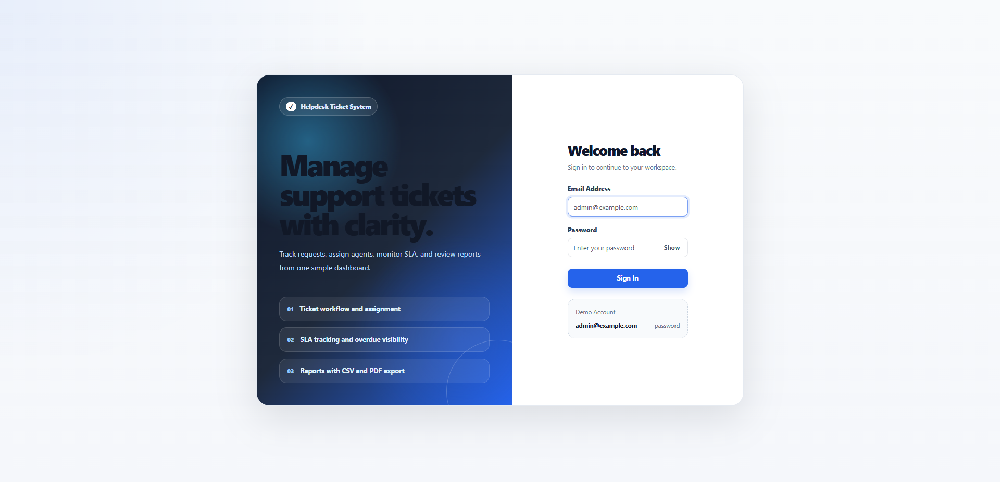
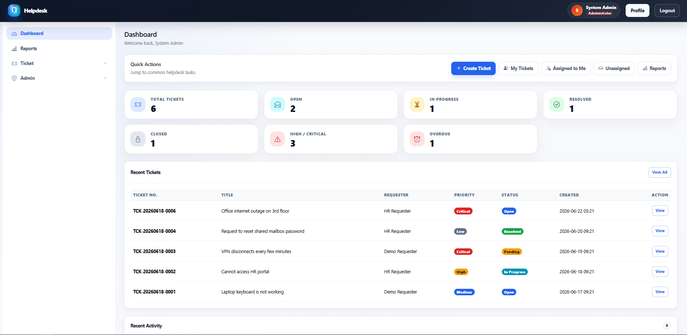
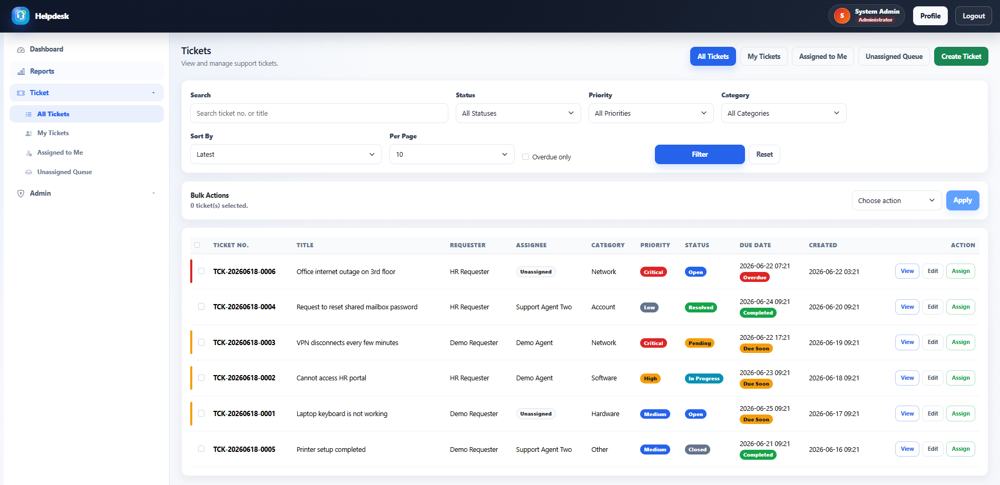
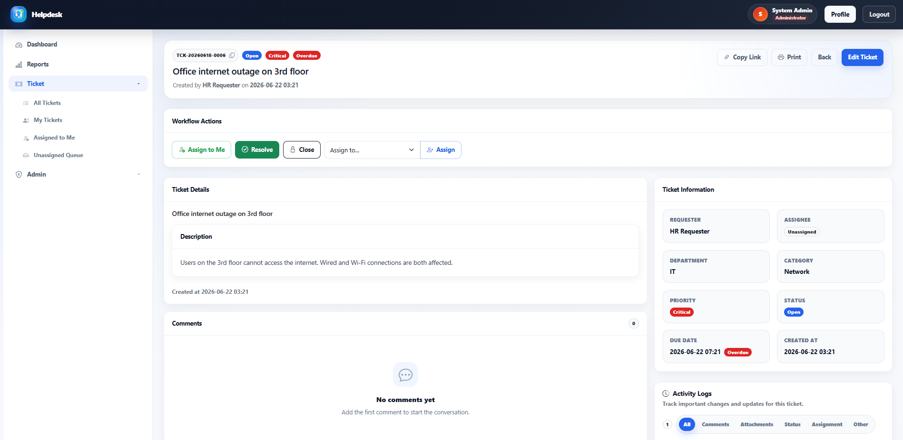
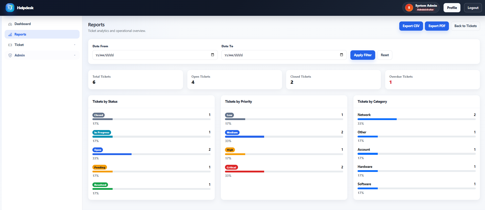

# Helpdesk Ticket System

A Laravel-based Helpdesk Ticket System built with Blade, Bootstrap, PostgreSQL, and role-based access control.
This project is designed as a portfolio application to demonstrate backend CRUD, authentication, ticket workflow, file attachments, activity logs, reporting, and admin management.

## Features

### Authentication & User Roles

- Login and logout with session-based authentication
- Role-based access control
- User profile and password management
- Active/inactive user handling

### Roles

- **Admin**
    - Manage users and master data
    - View and manage all tickets
    - Assign tickets to agents
    - Resolve, close, and reopen tickets
    - View reports and export data

- **Agent**
    - View assigned and unassigned tickets
    - Assign tickets to self or another support user
    - Add public replies and internal notes
    - Resolve, close, and reopen tickets

- **Requester**
    - Create support tickets
    - View own tickets
    - Add public replies
    - Upload attachments

### Ticket Management

- Create, view, edit, and manage tickets
- Ticket number auto-generation
- Ticket categories, priorities, statuses, and departments
- Ticket assignment and reassignment
- Due date and SLA tracking
- Overdue and due soon indicators
- Bulk actions for ticket assignment and closing
- Search, filters, sorting, pagination, and active filter chips

### Ticket Comments & Attachments

- Public replies
- Internal notes for admins and agents
- Multiple file attachments
- Attachment preview and download links
- File selection preview before submitting
- Support for selecting files multiple times before upload

### Activity Logs

- Ticket creation logs
- Comment and internal note logs
- Attachment logs
- Assignment change logs
- Status change logs
- Due date update logs
- Activity timeline filters

### Dashboard & Reports

- Dashboard summary cards
- Clickable ticket statistic cards
- Recent tickets and recent activities
- Report page with date filters
- CSV export
- PDF export

### Admin Management

- User management
- Department management
- Ticket category management
- Ticket priority management
- Ticket status management

### UI / UX

- Responsive layout
- Sidebar navigation
- Mobile offcanvas menu
- Bootstrap Icons
- Toast notifications
- Confirmation modal for ticket workflow actions
- Custom 403, 404, and 500 error pages
- Custom favicon and polished interface

## Tech Stack

- Laravel 12
- PHP 8+
- Blade Template Engine
- Bootstrap 5
- Bootstrap Icons
- PostgreSQL
- Laravel Eloquent ORM
- Laravel Form Request Validation
- DomPDF for PDF export
- CSV export with streamed response

## Live Demo

Production URL:

```text
https://helpdesk-ticket-system-production.up.railway.app/
```

You can test the system using the demo accounts listed in the **Demo Accounts** section below.

> Note: This demo project uses Supabase PostgreSQL as the production database. File uploads are intended for portfolio demonstration.

## Demo Accounts

After running the demo seeders, you can login with the following accounts:

| Role        | Email                                                   | Password |
| ----------- | ------------------------------------------------------- | -------- |
| Admin       | [admin@example.com](mailto:admin@example.com)           | password |
| Agent       | [agent@example.com](mailto:agent@example.com)           | password |
| Agent 2     | [agent2@example.com](mailto:agent2@example.com)         | password |
| Requester   | [requester@example.com](mailto:requester@example.com)   | password |
| Requester 2 | [requester2@example.com](mailto:requester2@example.com) | password |

## Installation

Clone the repository:

```bash
git clone https://github.com/sirawit-tanti/helpdesk-ticket-system.git
cd helpdesk-ticket-system
```

Install PHP dependencies:

```bash
composer install
```

Copy the environment file:

```bash
cp .env.example .env
```

Generate application key:

```bash
php artisan key:generate
```

Configure your database in `.env`:

```env
DB_CONNECTION=pgsql
DB_HOST=127.0.0.1
DB_PORT=5432
DB_DATABASE=helpdesk
DB_USERNAME=postgres
DB_PASSWORD=password
```

Run migrations and seeders:

```bash
php artisan migrate:fresh --seed
```

Create storage symbolic link:

```bash
php artisan storage:link
```

Start the development server:

```bash
php artisan serve
```

Then open:

```text
http://127.0.0.1:8000
```

## Seeder Information

The project includes demo seeders for:

- Roles
- Departments
- Ticket categories
- Ticket priorities
- Ticket statuses
- Demo users
- Demo tickets
- Demo comments
- Demo activity logs

Main seeder flow:

```php
$this->call([
    MasterDataSeeder::class,
    AdminUserSeeder::class,
    DemoDataSeeder::class,
]);
```

## Screenshots

### Login



### Dashboard



### Ticket List



### Ticket Detail



### Reports



## Project Highlights

This project demonstrates:

- Laravel MVC structure
- Form Request validation
- Role-based access control
- Ticket workflow design
- File upload handling
- Activity log tracking
- Dashboard and report generation
- Responsive Blade UI
- Real-world CRUD and business logic

## License

This project is created for portfolio and learning purposes.
